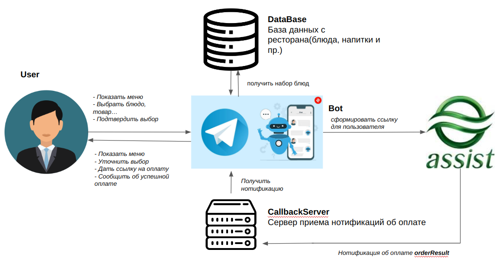

# The demo project of a telegram bot in the Assist payment system.


### The scheme of working



### Usage

- First of all, you have to register your bot to the @BotFather which you can find in telegram.
Then, if you have the username and token of the bot, you should set these authorization data into Bot.java

```java
      @Override
      public String getBotUsername() {
      return "yoursUsername";
      }
```
```java
      @Override
      public String getBotToken() {
      return "yoursToken";
      }
```

- Run the database container

``` bash
cd docker/
```
```bash
docker-compose up -d
```

- Build the project by maven 

```bash
mvn install
```

- Run the bot
```bash
java -jar target/telebot-1.0-SNAPSHOT.jar
```

- Enjoy!